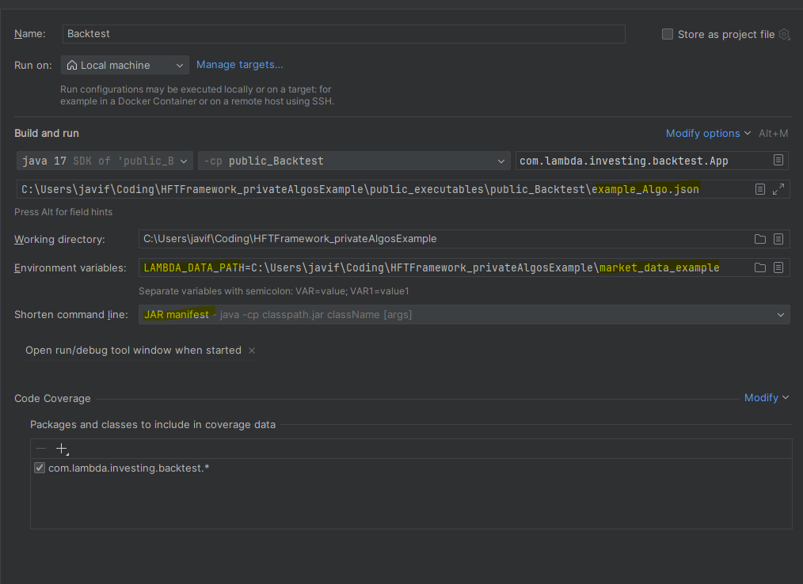
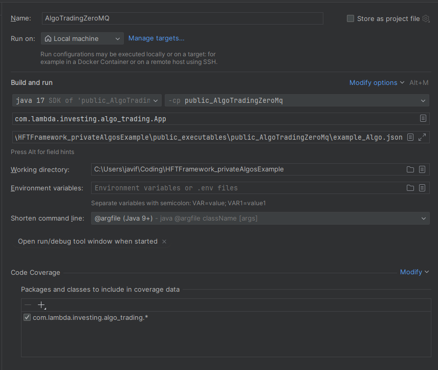

# HFTFramework_privateAlgosExample
An example repository demonstrating how to create custom trading algorithms compatible with HFTFramework.

## Overview
This repository shows how to create custom trading algorithms that integrate with the Java-based HFTFramework for both backtesting and live trading via ZeroMQ.

## Project Structure
```
HFTFramework_privateAlgosExample/
├── public_trading_algorithms/
│   └── src/main/java/com/lambda/investing/algorithmic_trading/
│       ├── provider/
│       │   └── ExampleTradingAlgorithmsProvider.java
│       └── ExampleAlgo.java
├── public_executables/
│   ├── backtest/
│   └── AlgoTradingZeroMQ/
└── README.md
```

## Creating a New Algorithm in `public_trading_algorithms`

### Step 1: Create Your Algorithm Class

Create a new Java class extending `SingleInstrumentAlgorithm` in the `public_trading_algorithms/src/main/java/com/lambda/investing/algorithmic_trading/` directory:

```java
package com.lambda.investing.algorithmic_trading.my_custom_algo;

import com.lambda.investing.algorithmic_trading.AlgorithmConnectorConfiguration;
import com.lambda.investing.algorithmic_trading.SingleInstrumentAlgorithm;
import com.lambda.investing.model.exception.LambdaTradingException;
import com.lambda.investing.model.market_data.Depth;
import com.lambda.investing.model.trading.ExecutionReport;
import com.lambda.investing.model.trading.OrderRequest;
import com.lambda.investing.model.trading.Verb;

import java.util.Map;

public class MyCustomAlgo extends SingleInstrumentAlgorithm {

    // Algorithm parameters
    private double param1;
    private double param2;
    private double quantity;

    public MyCustomAlgo(AlgorithmConnectorConfiguration algorithmConnectorConfiguration, 
                        String algorithmInfo, Map<String, Object> parameters) {
        super(algorithmConnectorConfiguration, algorithmInfo, parameters);
    }

    public MyCustomAlgo(String algorithmInfo, Map<String, Object> parameters) {
        super(algorithmInfo, parameters);
    }

    @Override
    public void setParameters(Map<String, Object> parameters) {
        super.setParameters(parameters);
        // Load your custom parameters
        param1 = getParameterDoubleOrDefault(parameters, "param1", 0.05);
        param2 = getParameterDoubleOrDefault(parameters, "param2", 1.5);
        quantity = getParameterDoubleOrDefault(parameters, "quantity", 0.01);
    }

    @Override
    public boolean onDepthUpdate(Depth depth) {
        boolean output = super.onDepthUpdate(depth);
        
        // Implement your trading logic here
        // Example: Access market data
        double bidPrice = depth.getBestBid();
        double askPrice = depth.getBestAsk();
        
        // Your signal generation logic
        if (/* your buy condition */) {
            OrderRequest request = createMarketOrderRequest(instrument, Verb.Buy, quantity);
            try {
                logger.info("Sending buy order: " + request.toString());
                sendOrderRequest(request);
            } catch (LambdaTradingException e) {
                logger.error("Error sending order: " + e.getMessage());
            }
        }
        
        return output;
    }

    @Override
    public boolean onExecutionReportUpdate(ExecutionReport executionReport) {
        boolean output = super.onExecutionReportUpdate(executionReport);
        // Handle execution reports (fills, cancels, etc.)
        logger.info("Execution report received: " + executionReport.toString());
        return output;
    }

    @Override
    public String printAlgo() {
        return "MyCustomAlgo [param1=" + param1 + ", param2=" + param2 + ", quantity=" + quantity + "]";
    }
}
```

### Step 2: Register Your Algorithm in the Provider

Add your algorithm to `ExampleTradingAlgorithmsProvider.java`:

```java
package com.lambda.investing.algorithmic_trading.provider;

import com.lambda.investing.algorithmic_trading.ExampleAlgo;
import com.lambda.investing.algorithmic_trading.my_custom_algo.MyCustomAlgo;
// ...other imports

@Component
public class ExampleTradingAlgorithmsProvider implements AlgorithmProvider {

    private enum AlgorithmType {
        EXAMPLE_ALGO("ExampleAlgo"),
        MY_CUSTOM_ALGO("MyCustomAlgo");  // Add your algorithm here

        private final String prefix;

        AlgorithmType(String prefix) {
            this.prefix = prefix;
        }

        private static AlgorithmType fromString(String algorithmName) {
            for (AlgorithmType type : values()) {
                if (algorithmName.startsWith(type.prefix)) {
                    return type;
                }
            }
            return null;
        }

        public Algorithm createAlgorithm(AlgorithmConnectorConfiguration config, 
                                        String algorithmName, 
                                        Map<String, Object> parameters) {
            switch (this) {
                case EXAMPLE_ALGO:
                    return new ExampleAlgo(config, algorithmName, parameters);
                case MY_CUSTOM_ALGO:
                    return new MyCustomAlgo(config, algorithmName, parameters);
                default:
                    throw new IllegalArgumentException("Unexpected value: " + this);
            }
        }
    }

    // ...rest of the provider code remains the same
}
```

### Step 3: Ensure Spring Component Scanning

Verify that `beans.xml` includes your algorithm package:

```xml
<?xml version="1.0" encoding="UTF-8"?>
<beans xmlns="http://www.springframework.org/schema/beans"
       xmlns:xsi="http://www.w3.org/2001/XMLSchema-instance"
       xmlns:context="http://www.springframework.org/schema/context"
       xsi:schemaLocation="...">

    <context:component-scan base-package="com.lambda.investing.algorithmic_trading.provider"/>

</beans>
```

This automatically discovers your `@Component` annotated provider.

## Using Your Algorithm in Backtesting (`public_executables/backtest`)

### Step 1: Create Configuration File

Create a JSON configuration file (e.g., `my_custom_backtest.json`):

```json
{
    "algorithmName": "MyCustomAlgo",
    "instrument": "BTCUSDT",
    "startDate": "2024-01-01T00:00:00Z",
    "endDate": "2024-12-31T23:59:59Z",
    "initialCapital": 100000.0,
    "parameters": {
        "param1": 0.05,
        "param2": 1.5,
        "quantity": 0.01
    },
    "dataSource": {
        "type": "csv",
        "path": "/path/to/historical_data.csv"
    },
    "exchange": "binance",
    "backtestConfiguration": {
        "commissionRate": 0.001,
        "slippageModel": "fixed",
        "slippageValue": 0.0001
    }
}
```

### Step 2: Run the Backtest

Execute from the command line:

```bash
cd public_executables/backtest
java -jar backtest.jar --config my_custom_backtest.json
```


### Step 3: Analyze Results

The backtest will output:
- **Console logs**: Real-time progress and trade executions
- **Performance metrics**: Total return, Sharpe ratio, max drawdown, win rate
- **Trade log**: CSV file with all executed trades
- **Equity curve**: Time series of portfolio value
- **Summary report**: JSON file with detailed statistics

Example output:
```
backtest 100% [===========] 18923/18923 (0:00:02 / 0:00:00) 14/12 11:59:59.598
Finished reading backtest Parquet: 3.050 s
sampleeur_kraken

	trades:933 (agg:933)  position:-0,010 totalPnl:-0,000 totalFees:0,000
	realizedPnl:-0,000  realizedFees:0,000 
	unrealizedPnl:-0,000  unrealizedFees:0,000 
Exit on stop in backtest
```
### Step 4: Launch from Python (optional)
set LAMBDA_JAR_PATH=public_executables\public_Backtest\target\Backtest.jar 
Create a python àlgorithm to launch the backtest based on [trading algorithms](https://github.com/javifalces/HFTFramework/tree/main/python/trading_algorithms)

```python
class MyCustomAlgo(Algorithm):
    NAME = AlgorithmEnum.my_custom_algo
    def __init__(self,  algorithm_info: str, parameters: dict = None):
        if parameters is None:
            parameters = copy.copy(DEFAULT_PARAMETERS)

        parameters = Algorithm.set_defaults_parameters(
            parameters=parameters, DEFAULT_PARAMETERS=DEFAULT_PARAMETERS
        )
        super().__init__(
            algorithm_info=Algorithm.get_algorithm_info(self.NAME, algorithm_info), parameters=parameters
        )
    def train(
            self,
            start_date: datetime.datetime,
            end_date: datetime,
            instrument_pk: str,
            iterations: int,
            algos_per_iteration: int,
            simultaneous_algos: int = 1,
    ) -> list:
        backtest_configuration = BacktestConfiguration(
            start_date=start_date,
            end_date=end_date,
            instrument_pk=instrument_pk,
            delay_order_ms=self.DELAY_MS,
            multithread_configuration=self.MULTITHREAD_CONFIGURATION,
            latency_engine_type=self.LATENCY_ENGINE_TYPE,
            fees_commissions_included=self.FEES_COMMISSIONS_INCLUDED,
            search_match_market_trades=self.SEARCH_MATCH_MARKET_TRADES
        )
        output_list = []
        for iteration in range(iterations):
            backtest_launchers = []
            for algorithm_number in range(algos_per_iteration):
                parameters = self.parameters
                algorithm_name = '%s_%s_%d' % (
                    self.NAME,
                    self.algorithm_info,
                    algorithm_number,
                )
                algorithm_configurationQ = AlgorithmConfiguration(
                    algorithm_name=algorithm_name, parameters=parameters
                )
                input_configuration = InputConfiguration(
                    backtest_configuration=backtest_configuration,
                    algorithm_configuration=algorithm_configurationQ,
                )

                backtest_launcher = BacktestLauncher(
                    input_configuration=input_configuration,
                    id=algorithm_name,
                    jar_path=JAR_PATH,
                )
                backtest_launchers.append(backtest_launcher)

            if iteration == 0 and os.path.isdir(backtest_launchers[0].output_path):
                # clean it
                self.clean_experience(output_path=backtest_launchers[0].output_path)

            # Launch it
            backtest_controller = BacktestLauncherController(
                backtest_launchers=backtest_launchers,
                max_simultaneous=simultaneous_algos,
            )
            output_dict = backtest_controller.run()
            output_list.append(output_dict)

        return output_list

    def parameter_tuning(
            self,
            start_date: datetime.datetime,
            end_date: datetime,
            instrument_pk: str,
            parameters_min: dict,
            parameters_max: dict,
            max_simultaneous: int,
            generations: int,
            ga_configuration: GAConfiguration,
            parameters_base: dict = DEFAULT_PARAMETERS,
    ) -> (dict, pd.DataFrame):

        return super().parameter_tuning(
            algorithm_enum=self.NAME,
            start_date=start_date,
            end_date=end_date,
            instrument_pk=instrument_pk,
            parameters_base=parameters_base,
            parameters_min=parameters_min,
            parameters_max=parameters_max,
            max_simultaneous=max_simultaneous,
            generations=generations,
            ga_configuration=ga_configuration,
        )
```

## Using Your Algorithm in Live Trading (`AlgoTradingZeroMQ`)

### Step 1: Configure Live Trading

Create a configuration file (e.g., `my_custom_live.json`):

```json
{
    "algorithmName": "MyCustomAlgo",
    "instrument": "BTCUSDT",
    "parameters": {
        "param1": 0.05,
        "param2": 1.5,
        "quantity": 0.01
    },
    "zeromq": {
        "marketDataSubscriberPort": 5555,
        "orderPublisherPort": 5556,
        "controlPort": 5557,
        "host": "localhost"
    },
    "exchange": {
        "name": "binance",
        "apiKey": "YOUR_API_KEY",
        "apiSecret": "YOUR_API_SECRET",
        "testnet": true
    },
    "riskManagement": {
        "maxPositionSize": 1000.0,
        "maxDailyLoss": 5000.0,
        "maxOpenOrders": 10
    },
    "logging": {
        "level": "INFO",
        "file": "logs/my_custom_algo.log"
    }
}
```

### Step 2: Start the ZeroMQ Market Data Bridge

The market data bridge must be running to feed data to your algorithm:

```bash
cd public_executables/AlgoTradingZeroMQ
java -jar market-data-bridge.jar --config my_custom_live.json
```


This will:
- Connect to the exchange WebSocket
- Publish market data to ZeroMQ port 5555
- Handle order routing on port 5556

### Step 3: Launch Your Algorithm

Start your trading algorithm:

```bash
java -jar AlgoTradingZeroMQ.jar --config my_custom_live.json --algorithm MyCustomAlgo
```



Example output
```
ExampleAlgo backtest ExampleAlgo_test_zeroMQ
FILTER TO RECEIVE 1 instruments : btceur_kraken
PAPER TRADING CONFIGURED!
#### PAPER TRADING zeroMqTradingEngine
MARKET DATA : localhost:6666
TRADING ENGINE: localhost:6677
```

### Step 4: Monitor and Control

#### Real-time Monitoring
The algorithm logs will show:
- Market data updates
- Order submissions and fills
- Position and PnL updates

## Requirements

- **Java**: 11 or higher
- **Maven**: 3.6+
- **ZeroMQ**: library (included in dependencies)
- **HFTFramework**: Core library must be installed https://github.com/javifalces/HFTFramework 

### Step 4: Launch from Python (optional)
set LAMBDA_ZEROMQ_JAR_PATH=public_executables\public_AlgoTradingZeroMq\target\AlgoTradingZeroMq.jar
create a python algorithm to launch the live trading based on [trading algorithms](https://github.com/javifalces/HFTFramework/tree/main/python/trading_algorithms)
```python
class MyCustomAlgo(Algorithm):
    NAME = AlgorithmEnum.my_custom_algo
    def __init__(self,  algorithm_info: str, parameters: dict = None):
        if parameters is None:
            parameters = copy.copy(DEFAULT_PARAMETERS)

        parameters = Algorithm.set_defaults_parameters(
            parameters=parameters, DEFAULT_PARAMETERS=DEFAULT_PARAMETERS
        )
        super().__init__(
            algorithm_info=Algorithm.get_algorithm_info(self.NAME, algorithm_info), parameters=parameters
        )
    def train(
            self,
            start_date: datetime.datetime,
            end_date: datetime,
            instrument_pk: str,
            iterations: int,
            algos_per_iteration: int,
            simultaneous_algos: int = 1,
    ) -> list:
        backtest_configuration = BacktestConfiguration(
            start_date=start_date,
            end_date=end_date,
            instrument_pk=instrument_pk,
            delay_order_ms=self.DELAY_MS,
            multithread_configuration=self.MULTITHREAD_CONFIGURATION,
            latency_engine_type=self.LATENCY_ENGINE_TYPE,
            fees_commissions_included=self.FEES_COMMISSIONS_INCLUDED,
            search_match_market_trades=self.SEARCH_MATCH_MARKET_TRADES
        )
        output_list = []
        for iteration in range(iterations):
            backtest_launchers = []
            for algorithm_number in range(algos_per_iteration):
                parameters = self.parameters
                algorithm_name = '%s_%s_%d' % (
                    self.NAME,
                    self.algorithm_info,
                    algorithm_number,
                )
                algorithm_configurationQ = AlgorithmConfiguration(
                    algorithm_name=algorithm_name, parameters=parameters
                )
                input_configuration = InputConfiguration(
                    backtest_configuration=backtest_configuration,
                    algorithm_configuration=algorithm_configurationQ,
                )

                backtest_launcher = BacktestLauncher(
                    input_configuration=input_configuration,
                    id=algorithm_name,
                    jar_path=JAR_PATH,
                )
                backtest_launchers.append(backtest_launcher)

            if iteration == 0 and os.path.isdir(backtest_launchers[0].output_path):
                # clean it
                self.clean_experience(output_path=backtest_launchers[0].output_path)

            # Launch it
            backtest_controller = BacktestLauncherController(
                backtest_launchers=backtest_launchers,
                max_simultaneous=simultaneous_algos,
            )
            output_dict = backtest_controller.run()
            output_list.append(output_dict)

        return output_list

    def parameter_tuning(
            self,
            start_date: datetime.datetime,
            end_date: datetime,
            instrument_pk: str,
            parameters_min: dict,
            parameters_max: dict,
            max_simultaneous: int,
            generations: int,
            ga_configuration: GAConfiguration,
            parameters_base: dict = DEFAULT_PARAMETERS,
    ) -> (dict, pd.DataFrame):

        return super().parameter_tuning(
            algorithm_enum=self.NAME,
            start_date=start_date,
            end_date=end_date,
            instrument_pk=instrument_pk,
            parameters_base=parameters_base,
            parameters_min=parameters_min,
            parameters_max=parameters_max,
            max_simultaneous=max_simultaneous,
            generations=generations,
            ga_configuration=ga_configuration,
        )
```
## Building the Project

### Build with Maven
```bash
mvn clean install
```

### Package for Deployment
```bash
mvn package
# Executable JAR will be in target/
```

## Troubleshooting

### Algorithm Not Found
- Verify algorithm is registered in `ExampleTradingAlgorithmsProvider`
- Check Spring component scanning includes your package
- Ensure class name matches the algorithmName in config

### ZeroMQ Connection Issues
- Confirm ports are not in use: `netstat -an | grep 5555`
- Check firewall settings
- Verify market data bridge is running

### Order Rejections
- Check API credentials
- Verify sufficient balance
- Ensure position limits not exceeded
- Review exchange-specific requirements

## Support

For questions and issues:
- Check HFTFramework main documentation
- Review example algorithms in `public_trading_algorithms/src/main/java/com/lambda/investing/algorithmic_trading/example_algo/`
- Enable DEBUG logging for detailed troubleshooting

## License

See main HFTFramework repository for license information.
